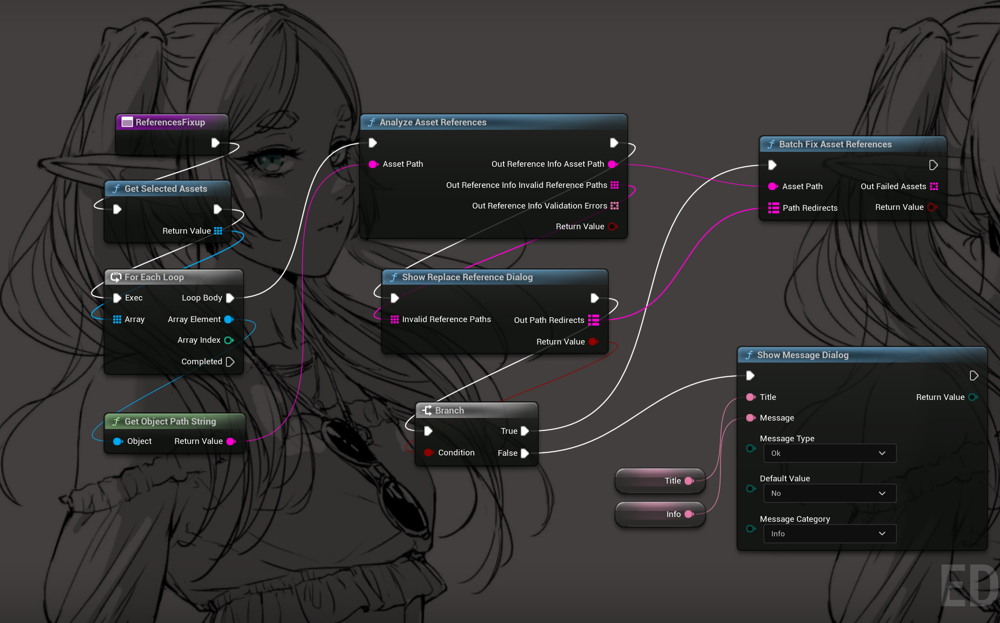

# UE5 .uasset file references fixer


### Description

基于 AssetHeaderPatcher, 通过修改 直接修改 .uasset 的 二进制内容，来修复引用错误。

Base on UE5 AssetHeaderPatcher, modify the binary content of .uasset directly, to fix the reference error.


### ATTENTION 

**使用前必须备份，否则可能会导致文件损坏**

**Before using, you must back up the file, otherwise it may cause file damage**

### Usage

#### 1. UCommandlet

```sh
UE5Editor-cmd.exe -ScanDirPath="X:/YourProject/Content/Blueprints/UI/" -InvalidRefPath="/Game/UI/Menu/LyraScrollBox" -NewRefPath="/Game/YourProject/Blueprints/UI/LyraScrollBox"
```

#### 2. Editor Utilites Blueprint




[更多信息](https://kisspread.github.io/notes/Tools/05FixReferencesTools.html)